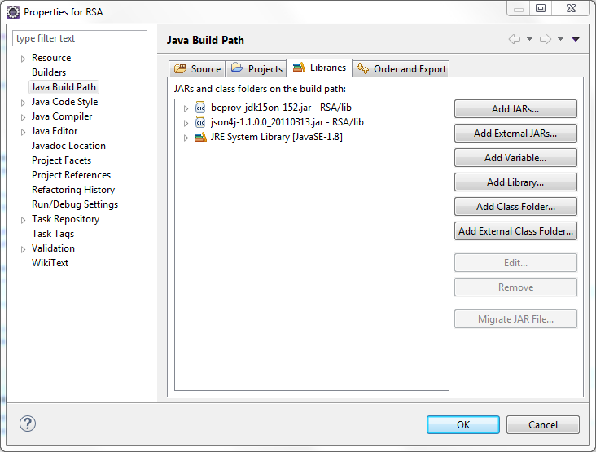

# MobileFirst Platform - Decrypting Presence Insights Device Data With Java

## Overview

To save sensitive user information in Presence Insights the preferred method is to add the information to the "data" field when registering or updating a device. Data entered in this field will be automatically encrypted when the device is registered or updated. 

Using this field requires [adding a public key](https://presenceinsights.ibmcloud.com/pidocs/configure/security) to an organization through the Presence Insights dashboard.

## Purpose

The main objective of this project is to demonstrate how to decrypt data encrypted data added to a device in Presence Insights.

To do this the code takes the following steps:

1. Logs into Bluemix using the user's credentials and acquires a token for future API calls
2. Creates an org in Presence Insights
3. Registers a device with a generic email and description
4. Retrieves the encrypted email and description
5. Decrypts the email and description using the user's private key

## Contents

This project contains the following files:

* **RSA.java** - main source code
* **test_key.pub** - public key file
* **test_key.pem** - private key file
* **bcprov-jdk15on-152.jar** - Bouncy Castle cryptography library
* **json4j-1.1.0.0_20110313.jar** - JSON library

## Running this code

*Note: All of the following instructions are specific to the Eclipse IDE*

In the Eclipse IDE follow these steps to setup and run the code:

1. Download the code and import it into Eclipse.
2. Add the Bouncy Castle and JSON4J libraries to the projects build path. 
	1. Click on **Project** > **Properties** > **Java Build Path**
	2. Click **Add External JARs...** and navigate to the location of the provided JAR 
files
	3. Add both JAR files as external JARs and select **OK**
	
		
3. Set the arguments in the project configuration
	1. Click **Run** > **Run Configurations...**
	2. Click the tab **Arguments**
	3. In the box labeled **Program arguments:** enter the values for your Bluemix username, Bluemix password, and tenant ID (each on a separate line)
	4. Click **Run**
	
		
4. Check the output. It should look similar to this: 

	
	
===

Copyright 2015 IBM Corp.

Licensed under the Apache License, Version 2.0 (the "License"); you may not use this file except in compliance with the License. You may obtain a copy of the License at http://www.apache.org/licenses/LICENSE-2.0 

Unless required by applicable law or agreed to in writing, software distributed under the License is distributed on an "AS IS" BASIS, WITHOUT WARRANTIES OR CONDITIONS OF ANY KIND, either express or implied. See the License for the specific language governing permissions and limitations under the License.
